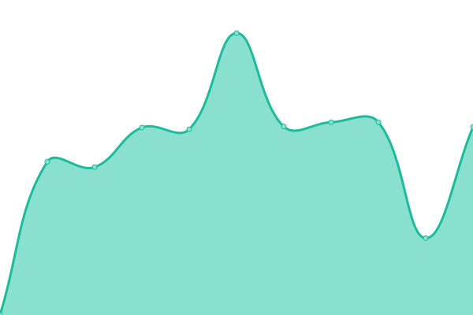

# [📈 Live Status](https://status.buttercrab.net): <!--live status--> **🟩 All systems operational**

This repository contains the open-source uptime monitor and status page for [Jaeyong Sung](https://status.buttercrab.net), powered by [Upptime](https://github.com/upptime/upptime).

With [Upptime](https://upptime.js.org), you can get your own unlimited and free uptime monitor and status page, powered entirely by a GitHub repository. We use [Issues](https://github.com/buttercrab/status.buttercrab.net/issues) as incident reports, [Actions](https://github.com/buttercrab/status.buttercrab.net/actions) as uptime monitors, and [Pages](https://status.buttercrab.net) for the status page.

<!--start: status pages-->
<!-- This summary is generated by Upptime (https://github.com/upptime/upptime) -->
<!-- Do not edit this manually, your changes will be overwritten -->
<!-- prettier-ignore -->
| URL | Status | History | Response Time | Uptime |
| --- | ------ | ------- | ------------- | ------ |
|  [Bitwarden](https://bitwarden.buttercrab.net) | 🟩 Up | [bitwarden.yml](https://github.com/buttercrab/status.buttercrab.net/commits/master/history/bitwarden.yml) | 

 654ms
     
 | 

<a href="https://status.buttercrab.net/history/bitwarden">100.00%</a>
    

|  [Code Server](https://code-server.buttercrab.net) | 🟩 Up | [code-server.yml](https://github.com/buttercrab/status.buttercrab.net/commits/master/history/code-server.yml) | 

 1206ms
     
 | 

<a href="https://status.buttercrab.net/history/code-server">100.00%</a>
    

|  [Owncloud](https://owncloud.buttercrab.net) | 🟩 Up | [owncloud.yml](https://github.com/buttercrab/status.buttercrab.net/commits/master/history/owncloud.yml) | 

 1281ms
     
 | 

<a href="https://status.buttercrab.net/history/owncloud">100.00%</a>
    

|  [Jetbrains Hub](https://hub.buttercrab.net) | 🟩 Up | [jetbrains-hub.yml](https://github.com/buttercrab/status.buttercrab.net/commits/master/history/jetbrains-hub.yml) | 

 1822ms
     
 | 

<a href="https://status.buttercrab.net/history/jetbrains-hub">100.00%</a>
    

|  [Jetbrains Teamcity](https://teamcity.buttercrab.net/login.html) | 🟩 Up | [jetbrains-teamcity.yml](https://github.com/buttercrab/status.buttercrab.net/commits/master/history/jetbrains-teamcity.yml) | 

 634ms
     
 | 

<a href="https://status.buttercrab.net/history/jetbrains-teamcity">99.24%</a>
    

|  [Jetbrains Upsource](https://upsource.buttercrab.net) | 🟩 Up | [jetbrains-upsource.yml](https://github.com/buttercrab/status.buttercrab.net/commits/master/history/jetbrains-upsource.yml) | 

 682ms
     
 | 

<a href="https://status.buttercrab.net/history/jetbrains-upsource">100.00%</a>
    

|  [Jetbrains Youtrack](https://youtrack.buttercrab.net) | 🟩 Up | [jetbrains-youtrack.yml](https://github.com/buttercrab/status.buttercrab.net/commits/master/history/jetbrains-youtrack.yml) | 

 1154ms
     
 | 

<a href="https://status.buttercrab.net/history/jetbrains-youtrack">100.00%</a>
    

<!--end: status pages-->

[**Visit our status website →**](https://status.buttercrab.net)

## 📄 License

- Powered by: [Upptime](https://github.com/upptime/upptime)
- Code: [MIT](./LICENSE) © [Jaeyong Sung](https://status.buttercrab.net)
- Data in the `./history` directory: [Open Database License](https://opendatacommons.org/licenses/odbl/1-0/)
